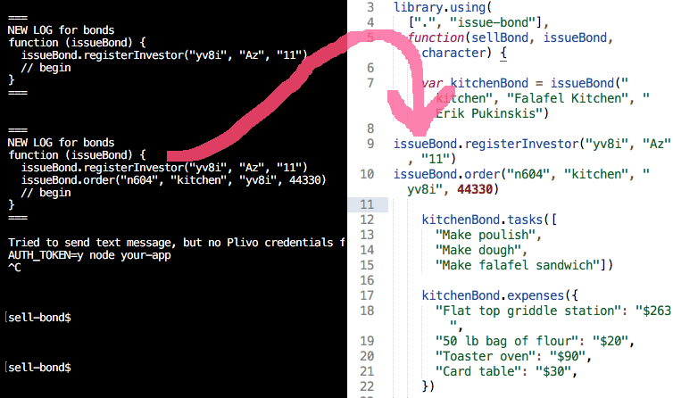

**a-wild-universe-appeared** logs simple function calls so they can be played back again.

```javascript
var aWildUniverseAppeared = require("a-wild-universe-appeared")
```

Create a universe called "meals" that uses the npm module called "my-pantry":

```javascript
universe = aWildUniverseAppeared("meals", {"myPantry": "my-pantry"})
```

### Sync it with S3:

```javascript
universe.persistToS3({
  key: process.env.AWS_ACCESS_KEY_ID,
  secret: process.env.AWS_SECRET_ACCESS_KEY,
  bucket: process.env.S3_BUCKET
})
universe.load(function() {
  // log has been played back
})
```

### Remember that a pantry existed:

```javascript
universe.do("myPantry", "eriks-pantry")
universe.do("myPantry.ingredient", "eriks-pantry", "paprika", "have")
universe.do("myPantry.ingredient", "eriks-pantry", "cocoa", "need")
```
### Replay the log:

```javascript
universe.playItBack()
var haves = myPantry.listHaves("eriks-pantry")
// Returns ["paprika")
```

### Quiet the incessant logging:

```javascript
universe.mute()
universe.mute(false) // turn it back on
```

### See the current log:

```javascript
console.log(universe.source())
```
will give you:
```javascript
function (myPantry) {
  myPantry("eriks-pantry")
  myPantry.ingredient("eriks-pantry", "paprika", "have")
  myPantry.ingredient("eriks-pantry", "cocoa", "need")
  // begin
}
```

### Listen to the log

If you want to do something whenever the log gets appended, like maybe you want to save the entry to a server, or you want to do some metrics thing, there's a method for that:

```javascript
myPantry.onStatement(
  function(functionName, args) {
    console.log(functionName+" was called with "+args.length+" arguments")
  }
)
```

### Mirror the log to some singletons

If you have statements coming in from somewhere else, like from a client on some other machine, and you want those statements to be reflected in your current state, you can pass some singletons in to a universe for it to play into:

```javascript
universe.mirrorTo({
  "my-pantry": myPantry})
universe.do("myPantry", "work-kitchen")
// myPantry will have been called with "work-kitchen"
```

You can do a similar thing when playing back the entire log:

```javascript
universe.playItBack({
  singletons: {
    "my-pantry": myPantry
  }
)
```

... although it will default to using the current module-library's singletons.

### Why?

You can persist things by storing source files.

Data loading can be debugged using your normal software debugging tools.

The disk format for your data is human readable.

Logs can be trivially split up and recombined in interesting ways.

You can easily set up test fixtures just by copying and pasting production logs into tests.

### Why it's amazing

Whenever you persist data, it dumps the new universe log to the console, so you can copy test data that results from your interaction into your demo code.

That makes it super easy to construct test cases that you can use while you are iterating your code:



That makes it much less likely that you'll need a production database on your development machine.

It also makes it much easier to test submodules independently of your app. You can just do something in your main app, copy out a resulting micro universe, and use it in a demo of the submodule.

### Plan for compaction

Obviously the elephant in the room is these logs get big fast.

Modules can provide a hook that takes a list of its own log entries, and compacts them into individual instances of the toplevel function, to the extent possible. So:

```javascript
person("Erik", "Carpenter")
person.changeName("Erik", "Bob")
person.changeProfession("Bob", "Potter)
```

would get compacted to

```javascript
person("Bob", "Potter")
```

It gets weird when there are other objects dependent on us:

```javascript
person("Erik", "carpenter")
delivery("Erik", "bonsai bench")
person.changeProfession("Erik", "woodsman")
delivery("Erik", "cedar")
person.changeName("Erik", "Bob")
person.changeProfession("Bob", "potter)
delivery("Bob", "bonsai pot")
```

I guess we have to go somewhere like this:

```javascript
person("Originally Erik", "carpenter")
delivery("Originally Erik", "bonsai bench")
person.changeProfession("Originally Erik", "woodsman")
delivery("Originally Erik", "cedar")
person.changeName("Originally Erik", "Bob")
person.changeProfession("Originally Erik", "potter)
delivery("Originally Erik", "bonsai pot")
```
This seems better:

```javascript
person("Bob", "potter")
delivery("Bob", "bonsai bench")
delivery("Bob", "cedar")
delivery("Bob", "bonsai pot")
```
Not sure how to get there. I guess we just 

```
registerArgumentMapping({personId: "Erik"},  /^Erik$/, "Bob", position-1412)
```
